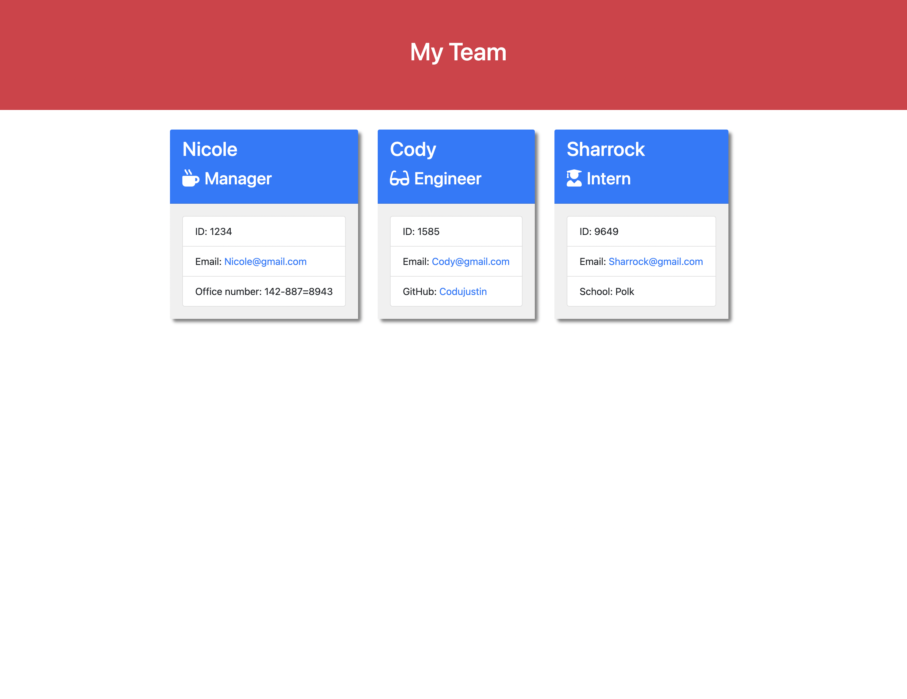

# Team-Profile-Generator

## Purpose 
Displays a nicely formatted team roster based on user input. 

## Table Of Contents
* [General info](#story)
* [Technologies](#built-with)
* [Walkthrough video](#Walkthrough-video) 
* [Screenshot](#screenshot)

## Story
AS a manager I want to generate a webpage that displays my team's basic info so that I have quick access to their emails and GitHub profiles.

## Built with
* Visual Studio Code 
* Node.js
* Inquirer
* Bootstrap
* Jest

## Walkthrough video

https://user-images.githubusercontent.com/97641313/166169116-b91fc7da-7d07-420f-b230-964975597da0.mp4

## Screenshot
 

